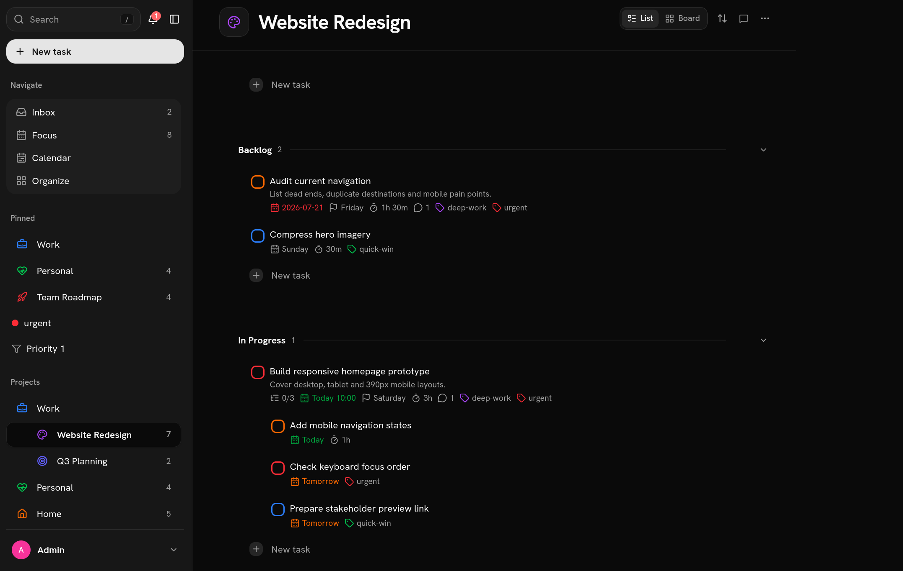
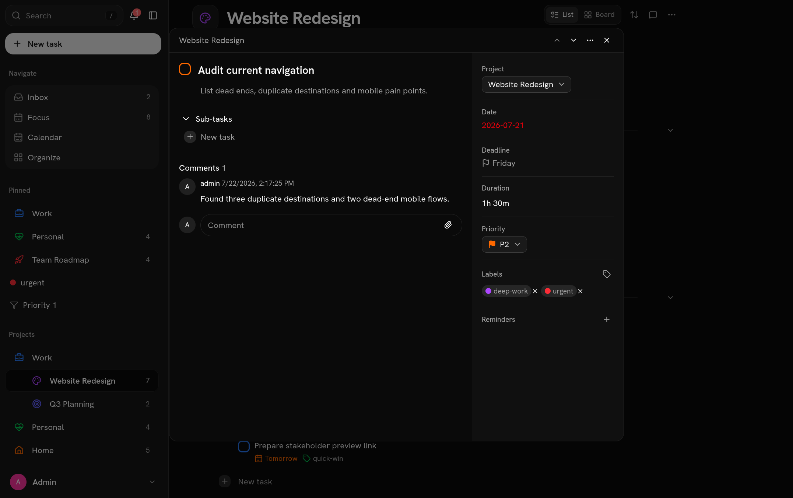

<p align="center">
  
</p>

<h1 align="center">Conatus</h1>

<p align="center"><em>Every goal starts with a next step.</em></p>

Conatus is a self-hosted task manager for projects, recurring work, reminders and collaboration inspired by Todoist.

- Organize work with projects, sections, labels and priorities
- Schedule recurring tasks, due dates, deadlines and reminders
- Collaborate through comments, file attachments and shared projects
- Import Todoist tasks and work from calendar, list or board views
- Connect through API tokens and webhooks

<p align="center">
  
</p>

<p align="center">
  
</p>

## Deploy Conatus

### 1. Get the Compose file and environment template

```bash
mkdir conatus
cd conatus

curl -O https://raw.githubusercontent.com/nojusmorkunas/conatus/main/docker-compose.yml
curl -o .env https://raw.githubusercontent.com/nojusmorkunas/conatus/main/.env.example
```

### 2. Edit your credentials

Open `.env` and set these values:

```env
# Use latest after the first stable release.
# Use 0.2.0-beta.1 when installing the beta release.
CONATUS_VERSION=latest
CONATUS_PORT=4399

POSTGRES_USER=app
POSTGRES_PASSWORD=replace-with-a-long-random-password
POSTGRES_DB=app

AUTH_SECRET=replace-with-a-long-random-secret

S3_ACCESS_KEY=replace-with-a-random-access-key
S3_SECRET_KEY=replace-with-a-long-random-secret-key

# Optional: creates the first administrator on an empty database.
CONATUS_ADMIN_USERNAME=admin
CONATUS_ADMIN_PASSWORD=replace-with-a-long-random-password
```

If you use a domain or reverse proxy, also set `AUTH_URL` and
`PUBLIC_BASE_URL` to the external HTTPS address.

### 3. Start Conatus

```bash
docker compose up -d
```

Docker Compose automatically pulls the Conatus application, operations,
PostgreSQL and MinIO images. Open [http://localhost:4399](http://localhost:4399)
and sign in with the administrator credentials from `.env`.

After the first login, remove `CONATUS_ADMIN_USERNAME` and
`CONATUS_ADMIN_PASSWORD` from `.env`.

For upgrades, update `CONATUS_VERSION` then run `docker compose up -d` again.
Back up the database before upgrading because some migrations require a restore
to roll back safely.

## API and MCP access

Create a scoped access token in Settings. The token is shown only once,
so copy it before leaving the page. Send it as a bearer token to any protected
v1 API route:

```bash
curl -H "Authorization: Bearer tdm_..." "http://localhost:4399/api/v1/tasks?completed=false"
```

Tokens can be reviewed and revoked from Settings.

The OpenAPI 3.1 description is served at `/api/v1/openapi.json`. Mutating task
creation endpoints accept `Idempotency-Key` while list endpoints use opaque cursor
pagination.

The independently installable MCP package lives in [`mcp-server`](./mcp-server).
It provides local stdio and remote Streamable HTTP transports so MCP-compatible
AI agents can manage tasks without direct database access. Remote mode supports
OAuth discovery, dynamic client registration, browser approval, S256 PKCE,
refresh-token rotation plus a static bearer fallback. A typical deployment uses
`tasks.example.com` for this app and `mcp.example.com/mcp` for the MCP sidecar. See
[`mcp-server/README.md`](./mcp-server/README.md) for client configuration.

## Webhooks

Add HTTPS (or localhost) endpoints in Settings to receive `task.created`,
`task.completed`, `task.uncompleted`, `task.deleted`, `comment.added`,
`project.created`, `project.archived` and `project.deleted` events. Each POST body
is `{ type, taskContent, projectId, projectName, occurredAt }`. Verify the
`X-Webhook-Signature` header by computing an HMAC-SHA256 of the raw request body
with the webhook secret, which is shown only once when the endpoint is created.

## Database migrations

```bash
npm run db:generate   # generate a migration from lib/db/schema.ts
npm run db:migrate     # apply migrations
npm run db:studio      # browse the database
```

## Backups

The `backup` service in `docker-compose.yml` dumps the database on a timer
into the `backups` volume, keeping the newest `BACKUP_KEEP` dumps (default
7, every `BACKUP_INTERVAL` seconds, default 86400/daily). Override either
via env vars.

Restore a dump:

```bash
docker compose exec -T db pg_restore -U app -d app --clean --if-exists < /path/to/app-<timestamp>.dump
```

Manual dump:

```bash
docker compose exec db pg_dump -U app -Fc app > backup.dump
```

## Contributing

See [`CONTRIBUTING.md`](./CONTRIBUTING.md) for local setup and verification
steps.

## License

AGPL-3.0. See `LICENSE`.
