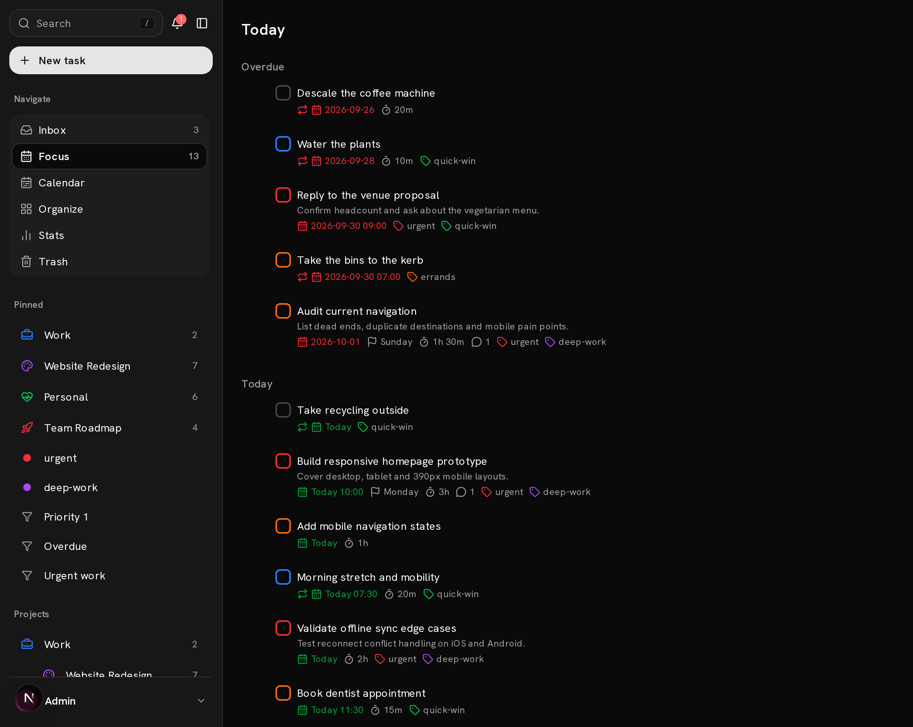
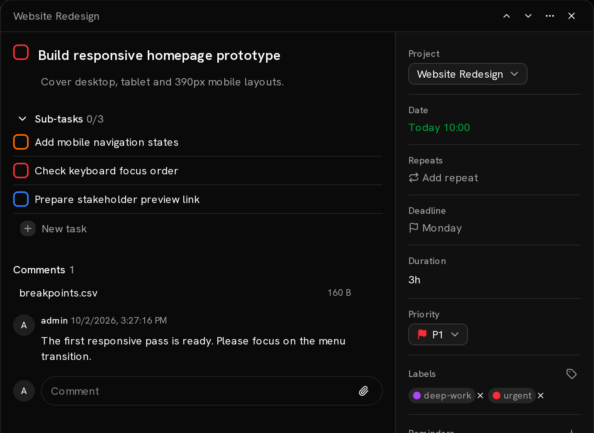

<h1 align="center">
  <picture>
    <source media="(prefers-color-scheme: dark)" srcset="./public/conatus-logo-dark.svg">
    
  </picture>
</h1>

<p align="center"><em>Every goal starts with a next step.</em></p>

<p align="center">
  <a href="https://github.com/nojusmorkunas/conatus/releases/latest"></a>
  <a href="./LICENSE"></a>
  <a href="https://github.com/nojusmorkunas/conatus/stargazers"></a>
</p>

<p align="center">
  <a href="https://demo.useconatus.com"><strong>Try the demo</strong></a> (<code>demo</code> / <code>demo</code>) ·
  <a href="https://useconatus.com">Website</a> ·
  <a href="https://useconatus.com/getting-started/install/">Docs</a> ·
  <a href="https://useconatus.com/todoist-alternative/">Compared with Todoist</a>
</p>

Conatus is a self-hosted task manager inspired by Todoist. It runs on your own server with Docker Compose, with tasks in PostgreSQL and files in S3 storage you control. AI agents can read, create, reschedule and complete your tasks through the [MCP server](https://github.com/nojusmorkunas/conatus-mcp), and your own scripts can use the REST API and webhooks. Conatus is free and open source under the AGPL.

<p align="center">
  <picture>
    <source media="(prefers-color-scheme: light)" srcset="./docs/screenshots/today-light.png">
    
  </picture>
</p>

- Projects with sections, sub-tasks, labels, four priorities and saved filters
- Recurring tasks with due dates, separate deadlines, durations and reminders
- [Quick add](./docs/natural-language.md) that reads dates, repeats, `p1`, `#project` and `@label` straight from the task name
- List, board and calendar views, plus an iCal feed for your calendar app
- Shared projects with comments, assignees and file attachments
- Todoist import from an API token or a backup file
- A REST API with scoped tokens, signed webhooks and an MCP server for AI agents
- Daily database backups from the first boot

<p align="center">
  <picture>
    <source media="(prefers-color-scheme: light)" srcset="./docs/screenshots/task-light.png">
    
  </picture>
</p>

## Deploy

### 1. Get the Compose file and environment template

```bash
mkdir conatus
cd conatus

curl -O https://raw.githubusercontent.com/nojusmorkunas/conatus/main/docker-compose.yml
curl -o .env https://raw.githubusercontent.com/nojusmorkunas/conatus/main/.env.example
```

### 2. Edit your credentials

Open `.env` and replace every `replace-with-...` value with your own:

```env
# latest follows the newest stable release. Pin an exact version without the
# leading "v" to upgrade only when you choose.
CONATUS_VERSION=latest
CONATUS_PORT=4399

POSTGRES_USER=app
POSTGRES_PASSWORD=replace-with-a-long-random-password
POSTGRES_DB=app

AUTH_SECRET=replace-with-a-long-random-secret

S3_ACCESS_KEY=replace-with-a-random-access-key
S3_SECRET_KEY=replace-with-a-long-random-secret-key

# Optional: creates the first administrator on an empty database.
CONATUS_ADMIN_USERNAME=admin
CONATUS_ADMIN_PASSWORD=replace-with-a-long-random-password
```

If you use a domain or reverse proxy, also set `AUTH_URL` and `PUBLIC_BASE_URL` to the external HTTPS address. The [reverse proxy guide](https://useconatus.com/getting-started/reverse-proxy/) has Caddy and nginx configs.

### 3. Start Conatus

```bash
docker compose up -d
```

Docker Compose pulls the Conatus application, operations, PostgreSQL and Silo images. Silo stores attachments and is a maintained fork of MinIO. Open [http://localhost:4399](http://localhost:4399) and sign in with the administrator credentials from `.env`, then remove `CONATUS_ADMIN_USERNAME` and `CONATUS_ADMIN_PASSWORD` from `.env`.

### Upgrading

Set `CONATUS_VERSION` to the new release, then run:

```bash
docker compose pull
docker compose up -d
```

Migrations run automatically before the application starts, and you can upgrade from any earlier published release. Back up the database first, since some migrations need a restore to roll back. See the [upgrade guide](https://useconatus.com/getting-started/upgrading/).

## Documentation

The full documentation is at [useconatus.com](https://useconatus.com/getting-started/install/):

- [Environment variables](https://useconatus.com/configuration/environment/)
- [Backups and restore](https://useconatus.com/configuration/backups/)
- [Users, registration and rate limits](https://useconatus.com/administration/users/)
- [REST API](https://useconatus.com/integrations/api/). The OpenAPI 3.1 description is at `/api/v1/openapi.json`
- [Webhooks](https://useconatus.com/integrations/webhooks/)
- [MCP server](https://useconatus.com/integrations/mcp/)
- [Migrating from Todoist](https://useconatus.com/migrate-from-todoist/)

## Contributing

Questions and ideas go in [Discussions](https://github.com/nojusmorkunas/conatus/discussions) and bugs in [Issues](https://github.com/nojusmorkunas/conatus/issues). See [`CONTRIBUTING.md`](./CONTRIBUTING.md) for local setup, database migrations and the checks a pull request needs to pass.

## License

AGPL-3.0-or-later. See [`LICENSE`](./LICENSE).

## Star history

<a href="https://www.star-history.com/?repos=nojusmorkunas%2Fconatus&type=date&releases=&legend=bottom-right">
 <picture>
   <source media="(prefers-color-scheme: dark)" srcset="https://api.star-history.com/chart?repos=nojusmorkunas/conatus&type=date&theme=dark&legend=bottom-right" />
   <source media="(prefers-color-scheme: light)" srcset="https://api.star-history.com/chart?repos=nojusmorkunas/conatus&type=date&legend=bottom-right" />
   
 </picture>
</a>
